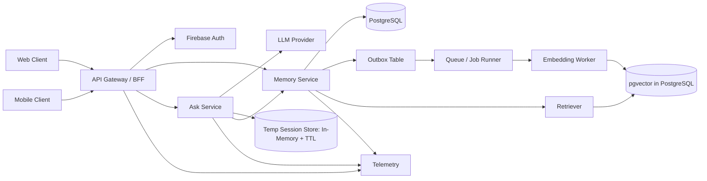
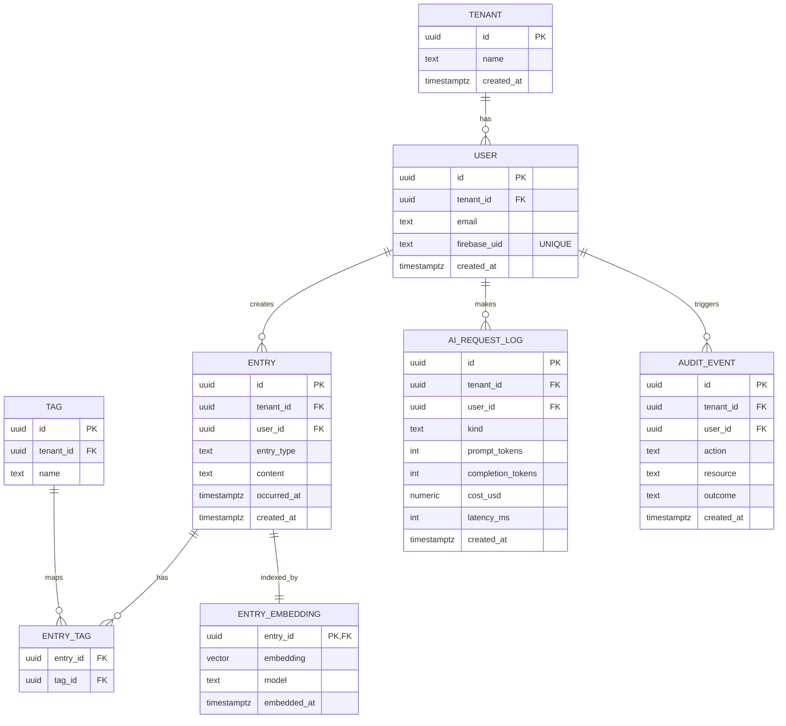
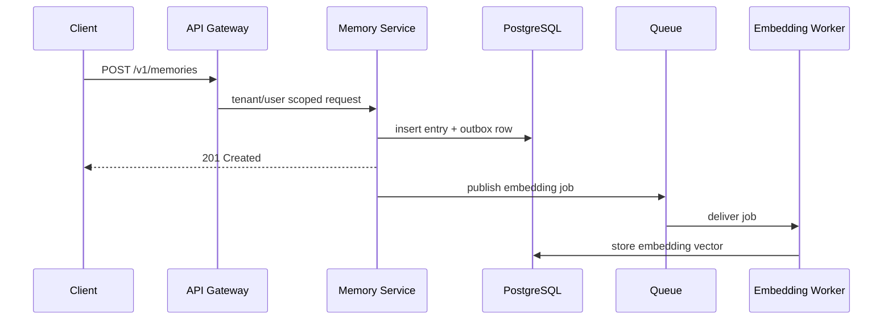
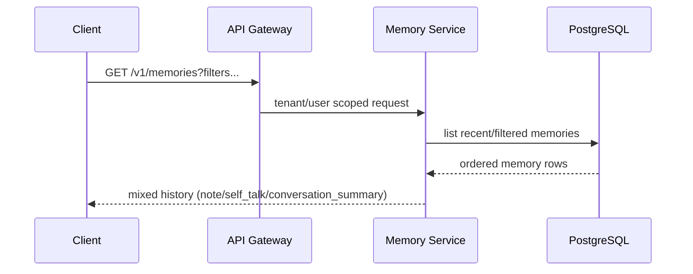
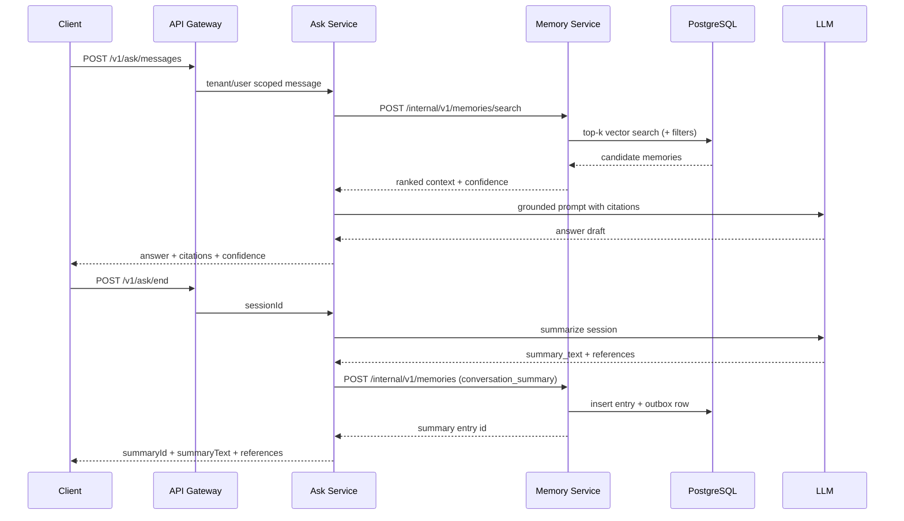

# V1 System Architecture: Second Memory

- Product: Second Memory
- Date: 2026-08-03
- Status: Draft
- Owner: Solo Builder (PO/Architect/Developer)

## 1. Goals and Scope

This architecture supports V1 journeys across web and mobile:

1. Fast capture of text entries (note and self_talk).
2. Timeline browsing with filters.
3. AI recall with grounded answers and citations.
4. Ask-session END summary storage (summary_text + references only).

Out of scope for V1:

1. Multimedia ingestion and retrieval (images, audio, video).

## 2. Architecture Principles

1. Privacy first: strict tenant/user scoping on every read and write.
2. Grounding over fluency: retrieved memories must anchor recall outputs.
3. Simple operations: managed services and one relational store for transactional + vector needs.
4. Async where possible: embedding generation and heavy jobs offloaded from request path.
5. Cost visibility: token and latency telemetry built in from day one.
6. Store compact continuity data: persist note/self-talk and conversation summaries, not full ask transcripts.

Implementation note:

1. Concrete MVP technology choices are documented in v1-implementation-decisions.md.
2. MVP repository layout and folder boundaries are documented in v1-monorepo-structure.md.

## 3. Logical Architecture

## 4. Runtime Components

1. Web Client
- Responsive browser UI for capture, timeline, and recall.
- MVP framework choice: Next.js.

2. Mobile Client
- Native or cross-platform app with the same core flows and API contract.
- MVP framework choice: Expo.

3. API Gateway / BFF
- Validates Firebase ID tokens, injects tenant/user context, handles rate limits.
- Resolves Firebase uid to internal USER.id and tenant_id before forwarding requests.

4. Memory Service
- Owns durable memory writes for note, self_talk, and conversation_summary entries.
- Serves history list/filter queries from PostgreSQL.
- Exposes retrieval/search primitives for Ask Service grounding.
- Writes memory rows and emits embedding jobs through outbox/queue.
- Enforces tenant and user boundaries on every read/write, including inter-service calls.
- MVP framework choice: NestJS.

5. Ask Service
- Owns chat orchestration with LLM and RAG composition.
- Maintains temporary ask-session context in-memory with TTL.
- On END, generates summary_text + references and calls Memory Service to persist conversation_summary.
- Persists no turn-level transcript in V1.

6. Embedding Worker
- Pulls pending jobs, computes embeddings, stores vectors.
- Retries transient failures with exponential backoff and dead-letter queue.
- MVP queue/runtime choice: Redis + BullMQ.

7. PostgreSQL + pgvector
- Source of truth for users, memories, tags, audit events, and vectors.

8. Telemetry Stack
- Centralized logs, metrics, traces, and token-cost events.

## 5. Data Model (Core Tables)

Notes:

1. Every business table includes tenant_id and user_id where applicable.
2. Enforce row-level security or equivalent policy checks in app layer plus DB safeguards.
3. Use partial indexes for time-window queries and type filters.
4. ENTRY.entry_type values: note, self_talk, conversation_summary.
5. Conversation summaries are stored as ENTRY rows with entry_type=conversation_summary.
6. keep USER.id as internal UUID primary key and store Firebase uid in USER.firebase_uid as unique, indexed text.

## 6. Key API Contracts (V1)

Auth contract for public APIs:

1. All public /v1/* endpoints require Authorization: Bearer <Firebase ID token>.
2. API Gateway/BFF verifies token signature and expiry, then resolves internal tenant/user context.

Public APIs

1. POST /v1/memories
- Owner: Memory Service
- Request: entryType(note|self_talk), content, occurredAt?, tags?, idempotencyKey?
- Response: entry id + created timestamp

2. GET /v1/memories
- Owner: Memory Service
- Query: from, to, entryType, keyword, cursor, pageSize(default=10)
- Response: ordered mixed history slice (notes + conversation summaries) + next cursor

3. POST /v1/ask/messages
- Owner: Ask Service
- Request: sessionId?, message, topK?, filters?
- Response: answer, citations[], confidence, lowConfidenceFlag

4. POST /v1/ask/end
- Owner: Ask Service
- Request: sessionId
- Response: summaryId, summaryText, references[]

Internal Service-to-Service APIs

5. POST /internal/v1/memories
- Owner: Memory Service
- Caller: Ask Service
- Request: entryType(conversation_summary), content, occurredAt?, sourceReferences?, idempotencyKey
- Response: entry id + created timestamp

6. POST /internal/v1/memories/search
- Owner: Memory Service
- Caller: Ask Service
- Request: query, topK?, filters?
- Response: ranked memories for grounding

## 7. Sequence Flows

### 7.1 Capture

### 7.2 History

### 7.3 Ask/Chat and END Summary

## 8. Security and Privacy Design

1. AuthN/AuthZ
- JWT validation at gateway.
- Tenant and user claims propagated as trusted context.
- Deny-by-default policy for missing/invalid scope.

2. Data Isolation
- Query templates always include tenant_id and user_id predicates.
- Automated tests for cross-tenant leak prevention.
- Memory Service re-validates tenant and user scope for internal calls from Ask Service.

3. Sensitive Data
- TLS in transit, encryption at rest.
- Optional field-level encryption for highly sensitive content.
- Structured audit logs for denied and privileged actions.

4. Prompt Safety
- Never send memories from outside scope to LLM.
- Redact operational secrets from prompts and logs.

## 9. Reliability and Performance

Targets from PRD:

1. Recall latency p95 < 4s.
2. No cross-tenant leakage.

Design choices:

1. Background embedding generation decouples write path latency.
2. Retrieval uses ANN index in pgvector and bounded top-k.
3. Idempotency key on write APIs for mobile and Ask END summary retry safety.
4. Ask Service stores temporary session context in-memory with TTL and clears state on END.

## 10. Observability and Cost Control

1. Metrics
- Request latency p50/p95 by endpoint.
- Retrieval hit quality proxy (top-k overlap on labeled set).
- Grounded answer rate and citation coverage.
- Token usage and cost by endpoint and user cohort.

2. Logs and Traces
- Correlation id per request across gateway, Memory Service, Ask Service, worker, and LLM calls.
- Structured error taxonomy for fast triage.

3. Alerts
- Recall p95 breaches for 15m.
- Hallucination incident rate threshold breaches.
- Daily AI cost anomaly alert.

## 11. Deployment Topology (Starter)

1. One cloud region for V1.
2. PostgreSQL with pgvector extension runs in Docker for MVP.
3. Stateless API services in containers.
4. Redis + BullMQ queue/worker runs in Docker for MVP.
5. Secrets in managed secret store.
6. See v1-implementation-decisions.md for concrete stack and revisit triggers.

## 12. Rollout Plan

1. Milestone A
- Memory Service capture/list endpoints, auth boundaries, DB schema, and embedding pipeline.

2. Milestone B
- Ask Service chat loop with temporary in-memory session context and retrieval integration.

3. Milestone C
- Ask END flow writes conversation_summary via Memory Service internal API with idempotent retries.

4. Milestone D
- Hardening: cross-tenant tests, retry behavior tests, and latency tuning for Ask-to-Memory hop.

## 13. Open Architecture Decisions

1. Hybrid retrieval weighting between lexical and vector similarity.
2. Confidence scoring formula and threshold for clarification prompts.
3. RLS in database vs strict application-only enforcement (or both).
4. Caching policy for future summary support and invalidation strategy.
